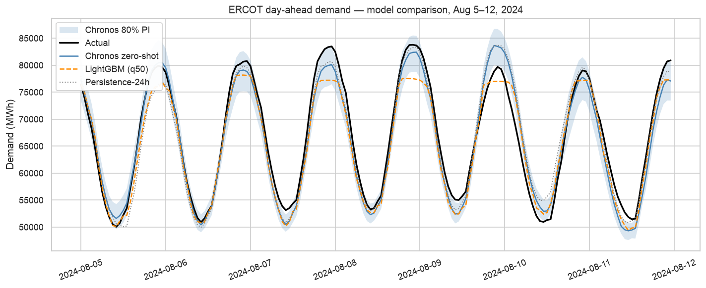

# ERCOT Demand Forecasting

A 24-hour-ahead hourly electricity demand forecasting comparison on the
Texas grid (ERCOT), pitting three approaches against each other:

1. **persistence-24h** — naive same-hour-yesterday baseline
2. **LightGBM** — gradient boosting with 23 engineered features (lags, calendar with US holidays, rolling stats, lagged Houston weather)
3. **Chronos-Bolt** — Amazon's zero-shot time-series foundation model (HuggingFace), no features beyond past demand

Companion project to [`energy-text2sql`](https://github.com/visethchapman/energy-text2sql) —
same dataset, different question. That repo *explores* the data agentically.
This one *predicts* from it.

> **Status:** v1 done. A zero-shot foundation model with no feature engineering
> beat hand-engineered LightGBM on every point-forecast metric.



---

## Scoreboard

24-hour-ahead forecasts evaluated on the full 2024 test year (8,784 hours):

| Method | MAPE | RMSE (MWh) | MAE (MWh) | 80% PI coverage |
|---|---|---|---|---|
| persistence-24h *(with residual-based PI from val residuals)* | 4.50% | 3,400 | 2,352 | 0.764 |
| LightGBM (engineered features, quantile regression) | 4.39% | 3,429 | 2,390 | 0.695 |
| **Chronos-Bolt zero-shot** | **4.33%** | **3,298** | **2,268** | 0.766 |

**Headline:** Chronos-Bolt-small, pre-trained on millions of time series and
used **zero-shot with no fine-tuning** on this data, beat hand-engineered
LightGBM on MAPE, RMSE, and MAE. 13 seconds of inference for a year of
hourly forecasts on an M4 MacBook Air CPU.

All three are slightly over-confident on prediction intervals (actual
coverage below the 0.80 target). LightGBM is the worst-calibrated;
persistence with residual-based PIs is competitive with Chronos.

---

## Approach

### Data

| Source | Rows | Range |
|---|---|---|
| `eia.demand` (ERCO region) | 43,847 hours | 2020-01-01 → 2024-12-31 |
| `noaa.daily_weather` (Houston station) | ~2,325 days | 2020-01-01 → 2026-05-13 |

Both come from the existing Postgres container in `energy-text2sql` —
this repo reuses it read-only, no data duplication.

### Train / val / test split

| Split | Range | Hours | Use |
|---|---|---|---|
| train | 2020-01-01 → 2023-06-30 | ~30,500 | fit LightGBM, persistence reference |
| val | 2023-07-01 → 2023-12-31 | ~4,400 | early stopping; residuals for residual-based PI |
| test | 2024-01-01 → 2024-12-31 | 8,784 | final evaluation — touched once |

Walk-forward in spirit; assertion in `forecasting/backtest.py` enforces
no temporal overlap.

### Models in detail

- **persistence-24h** — `ŷ(T) = y(T-24h)`. PIs from val-set residual quantiles (also called split conformal prediction) — same width every hour.
- **LightGBM** — 23 engineered features in `forecasting/features.py`: lags (24/25/48/72/168/192h), rolling stats (lagged ≥ 24h to avoid leakage), calendar + US holidays + sin/cos cyclical encoding, lagged Houston weather. Quantile regression at q=0.1…0.9. Shared params via `forecasting/models.py::train_lgbm()`.
- **Chronos-Bolt-small** ([HuggingFace](https://huggingface.co/amazon/chronos-bolt-small)) — 504-hour demand context only, no exogenous features. Zero-shot, native quantile output at q=0.1…0.9. ~13 s inference for the full 8,784-hour test year on CPU.

### Evaluation

- **Point metrics:** MAPE, RMSE, MAE
- **Probabilistic metrics:** actual coverage at the 80% PI, average PI width as % of mean demand (sharpness). Multi-level breakdown in notebook 05.
- **Reliability plot** (notebook 05): actual coverage vs target coverage — perfect calibration is the diagonal

### Missing-value handling

Rows with any missing feature or target are **dropped, not imputed**. About ~200
rows lost out of ~44,000 (early train rows with no lag history, plus a few weather
gaps). The impact on metrics is tiny.

- **LightGBM** could handle NaN natively (it can split on "is missing"); we drop instead for simplicity.
- **Chronos** requires contiguous numbers — drop is mandatory for it.
- **Persistence** predictions for hours without a 24h-ago value are masked out before scoring.

Dropping (vs imputing) keeps the three models comparable on the same rows.

### How to read the metrics

| Metric | Lower-better? | What it tells you |
|---|---|---|
| **MAPE / RMSE / MAE** | ✅ | Point-forecast error. MAPE is %, RMSE/MAE in MWh. |
| **Coverage** | At target | 80% PI should cover 80% of actuals. Below target = over-confident (bands too narrow). Above = wasteful (bands too wide). |
| **Sharpness** | ✅ if coverage is at target | Mean PI width as % of mean demand. Narrower is better — but check coverage first. |
| **Pinball loss** | ✅ | Direct score for one quantile prediction, in MWh. Lower = better-calibrated quantile. |

**Read coverage first, sharpness second.** Wide bands cheat coverage; narrow bands cheat sharpness. Only compare sharpness across models with similar coverage.

---

## What I learned

### 1. Zero-shot foundation models for time series are real now

I expected LightGBM with 23 carefully engineered features to win — it didn't.
Chronos-Bolt, with no calendar features, no weather, no holidays, and no
training on ERCOT data, beat LightGBM on every point metric. The model was
pre-trained on millions of diverse time series at Amazon, and pattern-matches
new sequences to learned dynamics. It's the same paradigm shift as LLMs:
generic pre-training beats narrow custom features for many downstream tasks.

### 2. Split-count importance is misleading; gain told a different story

LightGBM's default importance (split count) ranked `awnd_lag1` (wind) as the
top feature. Gain-based importance told a wildly different story: `lag_24h`
dominates by ~100× the next feature. Yesterday's same-hour demand is doing
nearly all the predictive work; weather and calendar features add thin
refinements.

This also explains why LightGBM barely beat persistence (4.39% vs 4.50% MAPE):
LightGBM's most important feature *is* the persistence baseline. The hand
engineering didn't add much new signal.

**Lesson:** split-count importance favors high-variance continuous features
(many fine-grained splits). Always cross-check with gain.

### 3. Calibration tells a story point metrics don't

| Model | Best point metric | Best calibration |
|---|---|---|
| Chronos | ✅ MAPE, RMSE, MAE | tied with persistence |
| Persistence + residual-based PI | — | ✅ at 80% PI |
| LightGBM | — | ❌ worst-calibrated |

LightGBM has the worst prediction intervals — its 80% PI only covers ~70% of
actuals. Persistence with val-set residual PIs (essentially free,
distribution-free) matches Chronos on calibration despite being the dumbest
point forecaster. If you only optimize point error, you miss this.

### Bonus: native-library conflict on Apple Silicon

LightGBM and PyTorch each bundle their own `libomp`. Running them in the
same process segfaulted (Exit 139, kernel died). Fix: set
`KMP_DUPLICATE_LIB_OK=TRUE`, `OMP_NUM_THREADS=1`, and `n_jobs=1` before
imports. Tracked in `TODO.md`.

---

## Notebooks

| # | Notebook | What it does |
|---|---|---|
| 01 | `01_eda.ipynb` | Seasonality, demand vs temperature, basic stats |
| 02 | `02_baselines.ipynb` | Three naive baselines (persistence, same-hour-last-week, 4-week average) |
| 03 | `03_lightgbm.ipynb` | LightGBM with engineered features + quantile regression |
| 04 | `04_chronos.ipynb` | Chronos-Bolt zero-shot batched inference |
| 05 | `05_calibration.ipynb` | Coverage, sharpness, and reliability plot across all three |
| 06 | `06_comparison.ipynb` | Final unified comparison + headline plot for this README |

---

## Quick start

**Prereqs:** Docker (Postgres from the companion `energy-text2sql` repo — or your own with the same `eia.demand` / `noaa.daily_weather` tables), Python 3.12 + [`uv`](https://docs.astral.sh/uv/), and on Apple Silicon: `brew install libomp` (LightGBM needs it).

```bash
cd ../energy-text2sql && docker compose up -d && cd -   # Postgres
cp .env.example .env                                     # config
uv sync                                                  # Python deps
uv run jupyter lab                                       # open notebooks

# Or run a single notebook headless:
uv run jupyter nbconvert --to notebook --execute notebooks/06_comparison.ipynb --inplace
```

---

## Repository layout

```
.
├── notebooks/          # 01_eda → 06_comparison (see Notebooks table above)
├── forecasting/        # Reusable modules
│   ├── data.py         # load_demand(), load_weather()
│   ├── backtest.py     # walk-forward split with leakage assertion
│   ├── features.py     # lags, calendar, cyclical, weather
│   ├── metrics.py      # MAPE, RMSE, MAE, coverage, pinball
│   └── models.py       # shared train_lgbm() helper
├── results/            # scoreboard.json + calibration.json
├── assets/             # headline.png
├── TODO.md             # v2 ideas + platform notes
├── pyproject.toml
└── README.md
```

---

## v2 ideas (see [TODO.md](TODO.md))

- **Residual learning for LightGBM** — predict y(T) - y(T-24) instead of raw y(T) (highest expected ROI)
- **Fine-tune Chronos** on the train split (typically 5-15% gain vs zero-shot, requires GPU)
- **Walk-forward CV** instead of single train/val/test split
- **Optuna hyperparameter search** for LightGBM
- **Adaptive conformal** (CQR or locally weighted) for input-dependent PI widths

---

## License

MIT.

## Acknowledgments

- **EIA Open Data** — public hourly demand by US balancing authority
- **NOAA GHCN-Daily** — public daily weather station observations
- **Amazon Chronos** — [`amazon/chronos-bolt-small`](https://huggingface.co/amazon/chronos-bolt-small) on HuggingFace
- Built with [LightGBM](https://github.com/microsoft/LightGBM), [HuggingFace transformers](https://github.com/huggingface/transformers), [pandas](https://pandas.pydata.org/), [matplotlib](https://matplotlib.org/), and [`uv`](https://docs.astral.sh/uv/).
